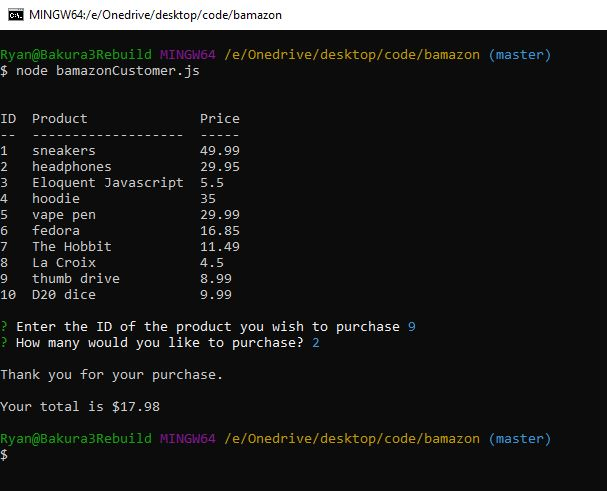
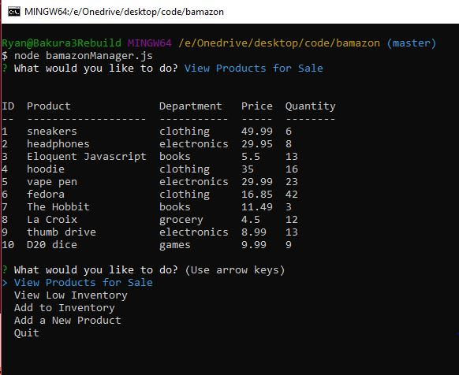
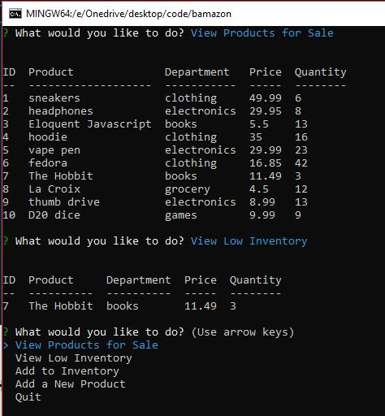
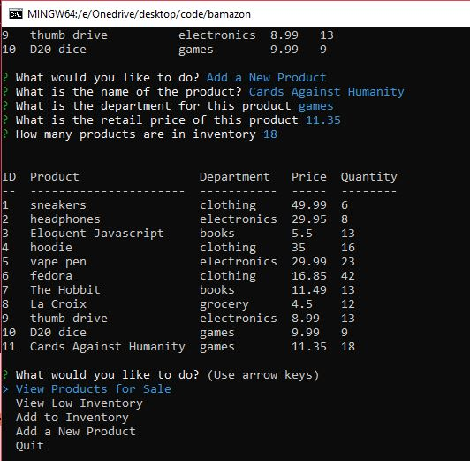

# Bamazon

## Overview

Bamazon is a Node CLI application that provides a "Storefront" to purchase items and manage inventory.

MySQL and the MySQL Node package power the data storage and retrieval of this application.

## Customer View

* The customer is presented with all available items (items with 0 on-hands are not displayed)
* The customer then enters the ID of the item they wish to purchase and quantity
* The record for that product is updated on the database

## Manager View

The manager view is an inventory management application with four options

### View Products for Sale

Queries the products table for all entries and all columns, including price and available quantities, and displays them in the console

### View Low Inventory

Queries the products table for all entries with less than 5 on-hands and displays the results in the console

### Add to Inventory

The manager can add to the available inventory of a single item. The stock_quantity column is updated with the existing value plus the additional quantities

### Add New Product

The manager can enter the properties of a new product and a new record is inserted into the products table

